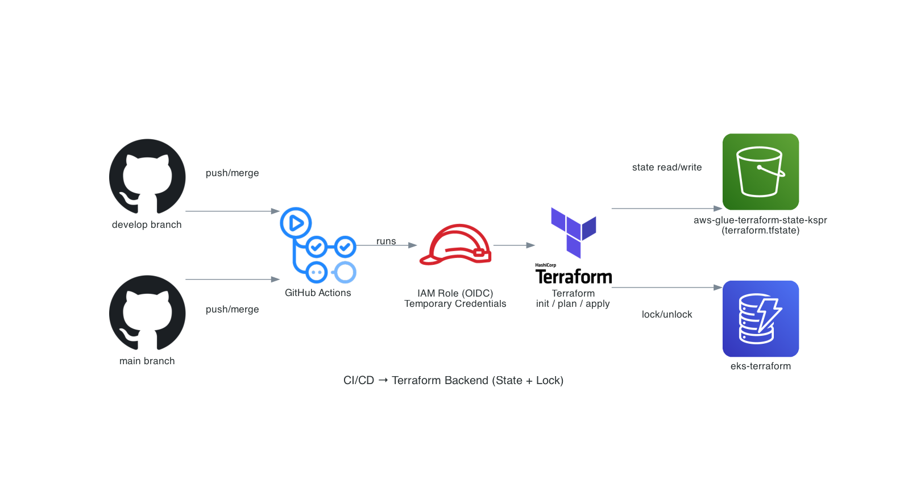
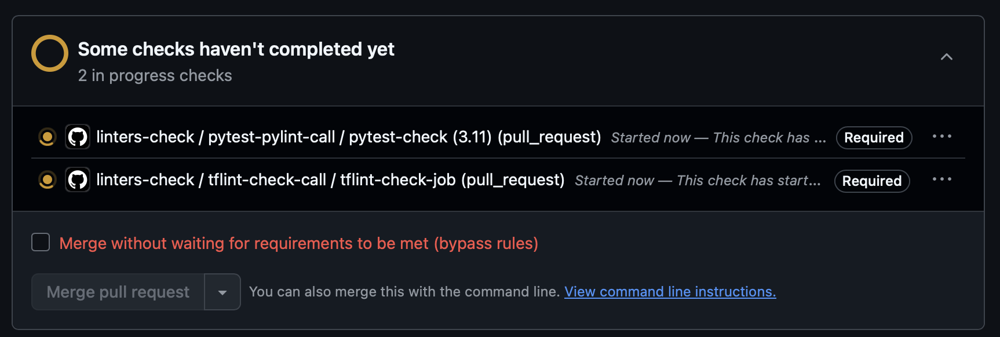
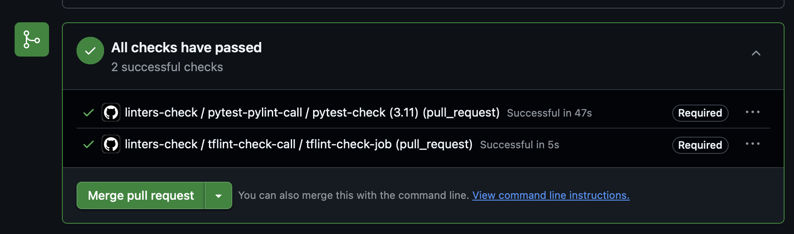
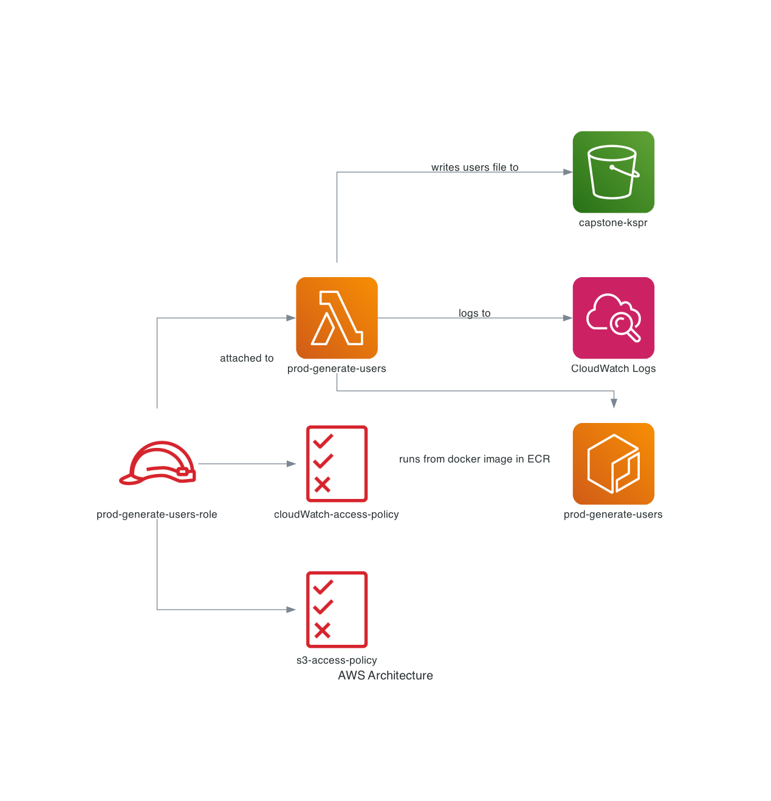

# CICD Pipelines levaraging terraform workspaces for handling SDLC  
### Aim: To demonstrate how we can use terraform workspaces to handle the aws resources in project in various stages of development, Also added Lambda code deploying using docker. 
### Main focus is to demonstate the CICD pipelines

# Project segments
- OIDC connect For AWS role
- GitHub Environments
- Terraform 
  - Used workspaces feature as demo
  - [docs](https://developer.hashicorp.com/terraform/cloud-docs/workspaces#creating-workspaces)
- Lambda in docker ( This is just an example and yes the code is very very basic , just for demo only to show how it can used in conjunction with terraform )
  - Uses Docker image in Lambda 
    - Solving the fact that we can store 10GB for installing libraries which can not be handled by layers
  - Testing code in Lambda from local
    - Added docker compose file which will spin docker container. 
    - Curl command to send payload to docker container to run and test the code
  - Added pytest use case with aws moto library and mock aws services ( for example s3 bucket in this case )

# CICD Github Actions pipeline image
* 

# OpenID Connect
- [openid-connect Docs](https://docs.github.com/en/actions/concepts/security/openid-connect)
- [oidc-in-aws](https://docs.github.com/en/actions/how-tos/secure-your-work/security-harden-deployments/oidc-in-aws)
- Go to Aws Console
  - Click on IAM 
  - Click on Identiry providers
  - Click on Add provider 
  - Select OpenID Connect 
  - In provider URL give below address
    - https://token.actions.githubusercontent.com
  - Audience
    - sts.amazonaws.com
  - Click on Add provider
- Create a IAM role
  - Add permissions
    - Attach existing policies directly
    - Select AdministratorAccess - <span style="color: red;">BAD BAD BAD DONT DO IT.</span>  (for demo purpose only, for production create custom policy)
  - Click on Trust Relationships
    - Click on Edit trust relationship
      - Add your prinicpal which created in above opendi connect steps
      - Add aud "token.actions.githubusercontent.com:aud": "sts.amazonaws.com"
      - Add sub "token.actions.githubusercontent.com:sub": "repo:RepoOwner/individualProject/*"
    - Replace the existing policy with below policy
    ```json
        {
            "Version": "2012-10-17",
            "Statement": [
                {
                    "Effect": "Allow",
                    "Principal": {
                        "Federated": "arn:aws:iam::AWS_ACCOUNT_NUMBER:oidc-provider/token.actions.githubusercontent.com"
                    },
                    "Action": "sts:AssumeRoleWithWebIdentity",
                    "Condition": {
                        "StringEquals": {
                            "token.actions.githubusercontent.com:aud": "sts.amazonaws.com"
                        },
                        "StringLike": {
                            "token.actions.githubusercontent.com:sub": "repo:RepoOwner/*"
                        }
                    }
                }
            ]
        }
    ```

# Github Environments
- Go to the Project Settings
- Click on Environments
- Click on New environment
- Name the environments
  - production - Production account details
    - Click on Add Environment Variables
      - Add name AWS_IAM_ROLE and add the role name 
      - Add name AWS_REGION and add the region value 
  - development - Development account details
    - Click on Add Environment Variables
      - Add name AWS_IAM_ROLE and add the role name 
      - Add name AWS_REGION and add the region value 


# Getting Started

## Prerequisites
Before running Terraform, update these values:
- AWS Role ARN in trust relationship policy (replace `AWS_ACCOUNT_NUMBER` and `RepoOwner`)
- S3 bucket: `aws-glue-terraform-state-kspr` in BACKEND_BUCKET variable 
- State file key: `lambda-tf-workspaces-cicd/workspaces/terraform.tfstate` BACKEND_BUCKET_KEY variable
- DynamoDB table: `eks-terraform` in DYNAMODB_TABLE variable
- GitHub Environment variables (AWS_IAM_ROLE and AWS_REGION)

## Initial Setup
1. **Clone the repository**
2. **Configure backend**: Keep only `backend.tf` and `variables.tf` with your AWS environment values
3. **List of all worflows**
    - workspace-tf-plan.yaml
      - event_type: worflow_call ( i.e, this can be called from another workflow )
      - job/steps
        - checks out respository
        - installs aws credentails to connect with AWS 
        - Installs Terraform 
        - Decides what workspace and which tfvars file should be used based on the branch
        - Initiates terraform and runs validate 
        - creates workspace and runs plans with the tfvars file based on the values from above step
        - Applies the terraform plan if the apply_env value is given as true else it will show the plan
        - Uploads the artifacts in the repository
      - output from this steps as below
        - environment - derived based on branch name 
        - artifcat name where the plan is uploaded
        - tf_workspace - this is derived from the branch name 
        - vars_file - to determine which vars file need to be used based on the workspace
    - aws-resources-apply.yaml
      - event_type: workflow_dispatch ( i.e This need to be triggered manually , designed on purpose to make sure every one checks before applying )
      - inputs:
        - apply_env - defaults false
      - job1:
        - This calls workspace-tf-plan
          - default value for apply_env as false - this show the terraform plan ( always good to see the plan before applying )
          - change the value for apply_env as true by selecting the check box - this will apply and resources will be created/modified
    - aws-resources-destroy.yaml
      - event_type: workflow_call,workflow_dispatch - can be called from another worflow and can be triggered manually
      - inputs:
        - destroy_env - defaults false
      - job1:
        - set-up-flag
          - chekcs if the flag need to be true or false - depends on multiple conditions
            - if its main and develop then destroy_env flag will be false as we dont want to destroy the develop and production
            - if its feature or hotfix branch then the value which is given as input will be applied
      - job2:
        - common:
          - runs only after set-up-flag is completed , which runs the plan - i want to always generate the plan fresh than using stale plan
          - output from this steps as below
            - environment - derived based on branch name 
            - artifcat name where the plan is uploaded
            - tf_workspace - this is derived from the branch name 
            - vars_file - to determine which vars file need to be used based on the workspace
      - job3
        - destroy:
          - checks out the repo
          - sets up aws credentials
          - downloads artifacts which have freshly generated tfplan
          - destroys aws resources
            - terraform init will takes place
            - terraform select workspace
            - terraform destory 
            - terraform select changes workspace to default
            - terraform delete the workspace 
    - branch-delete.yaml
      - event_type: worflow_call, workflow_dispatch - can be run independently and can be called from different workflow
      - inputs:
        - branch_name
      - job1:
        - checks out repo
        - deletes the branch which is given as input
    - feature-branch-destroy - This is beautiful - There will be no concept of oops forgot to destroy feature branch resources and forgot to delete the branch ;-)
      - event_type: pull_request ( closed on develop and branch should start with feature ) - this automatically kicks in
      - job1
        - calls aws-resources-destory workflow with destory_evn value as true - This destorys all the feature branch related aws resources
        - This call branch-delete workflow and passes the branch name which was just merged to develop
    - hotfix-branch-destroy - This is beautiful - There will be no concept of oops forgot to destroy hotfix branch resources and forgot to delete the branch ;-)
      - event_type: pull_request ( closed on main and branch should start with hotfix ) - this automatically kicks in
      - job1
        - calls aws-resources-destory workflow with destory_evn value as true - This destorys all the hotfix branch related aws resources
        - This call branch-delete workflow and passes the branch name which was just merged to main
    - tflint-check workflow - i usually want to keep this seperate for terraform 
      - event_type: workflow_call
      - job1:
        - checks out repo
        - runs tflint
    - pytest-pylint workflow - i usually want to keep this seperate for python projects
      - event_type: workflow_call
      - job1:
        - checks out repo
        - sets up python based on what version that are listed in the strategy matrix
        - Installs requirments and sets pythonpath
        - runs pylint
        - runs pytest
        - runs pytest cov and only pass if the test coverage is 100%
    - linters-check workflow - automatically kicks in when any pull request is created on main or develop
      - event_type: pull_request on main and develop
      - job1:
        - runs the tflint-check workflow
      - job2: ( if you have python project or you can remove this )
        - runs the pytest-pylint workflow
    - terraform-lock-release workflow
      - event_type: workflow_dispatch - triggers manually
      - inputs:
        - workspace
      - variables used:
        - backend_bucket
        - backend_bucket_key
        - dynamodb_table
      - job1:
        - checks out repo
        - sets aws credentials
        - constructs LockID with given input and variables 
        - deletes the dynamodb entry to release lock scenarios

# Important step is changes in the project settings.
1. Click on settings in the project
2. Click on Rulesets
3. Click on newruleset
4. Select import a ruleset - You will find the ruleset for prod and dev in folder rules
    - prod.json
    - dev.json
5. Import above files and you are all set. 
6. This will create two mandatory steps that should be completed , then only you can merge as shown below 
7. Before mandatory checks passed shown as below screenshot - Do not worry about the merge without message , because owner will only have that which i have added in the settings , you can remove that if you wish 
   - 
8. After mandatory checks passed shown as below screenshot
   - 
7. You can go bananas on the rules , i would leave up to project owners for that. 


4. **Run initial workflow**:
  - Go to GitHub Actions → "aws-resources-apply" workflow
  - Select main branch → Click "Run workflow"
  - **Checkbox options**:
    - `false` (default): Init and plan only, creates state file in S3
    - `true`: Init, plan, and apply resources

## Workspace Mapping
Below is how the workspaces will be created from github actions workflow workspace-tf-plan and creates a LockID (shown below ) with files name attached with -md5 in the dynamodb table if everything is successfull , if not , the entry will not have md5 and there will be a lock associated in dynamo. In that case no plans will run until the lock is removed. This is reason i have terraform-lock-release workflow :) 
| Branch Pattern | Workspace | S3 State Location  | LockID In Dynamodb Table |  
|---|---|---|---|
| `main` | `prod` | `s3://bucket/env:/prod/...terraform.tfstate` | `s3://bucket/env:/prod/...terraform.tfstate-md5` |
| `develop` | `dev` | `s3://bucket/env:/dev/...terraform.tfstate` | `s3://bucket/env:/dev/...terraform.tfstate-md5` |
| `feature/1111-kosana` | `kosana` | `s3://bucket/env:/kosana/...terraform.tfstate` | `s3://bucket/env:/kosana/...terraform.tfstate-md5` |
| `hotfix/0000-prakash` | `hotfix-prakash` | `s3://bucket/env:/hotfix-prakash/...terraform.tfstate` | `s3://bucket/env:/hotfix-prakash/...terraform.tfstate-md5` |

## Add Resources
1. Add `ecr.tf` to terraform folder
2. Push code to repository
3. Run workflow with checkbox enabled to apply changes
4. Check AWS and you will see the resources that are created successfully. 

# Develop Lifecycle 
1. Create a branch called develop from main
2. Push the code to repo
3. Go to the GitHub Actions tab - Testing aws-resources-apply workflow for develop branch
    - Follow the same steps to run your workflow as you did before. 
    - workspace dev will be created with ECR repo
    - Verify the tfplan step in the workflow to see if the appropriate resources creation is in the plan
    - once you have verified that plan is being populated as expected , re run the action now by enabling the checkbox and once the plan is successfully complete you can see the aws resource will generate as shown in the plan from above step

# Individual contributor lifecycle - developer SDLC - Make sure you create branch starts with "feature/"
1. Create a branch called feature/1111-kosana from develop
2. Push the code to repo
3. Go to the GitHub Actions tab - Testing aws-resources-apply workflow for kosana/or any individual contributor branch
    - Follow the same steps to run your workflow as you did before. 
    - workspace kosana will be created with ECR repo
    - Follow the steps above to verify resources has been created in the aws environment
    - Now for testing change some values in the tags just for fun and add the code changes and push the code
    - Run the workflow again and observe the changes in your aws resources based on the changes in the code push
4. Its time to create merge request to develop
5. Create a pull request from feature/1111-kosana to develop branch
6. Once the PR is approved and merged , Go to the GitHub Actions tab,you will see the feature-branch-destory worflow starts running and completes the cleanup of aws resources and branch

# hotfix lifecycle - Make sure you create branch starts with "hotfix/"
1. Create a branch called hotfix/0000-prakash from main
2. Push the code to repo
3. Go to the GitHub Actions tab - Testing aws-resources-apply workflow for hotfix/0000-prakash
    - Follow the same steps to run your workflow as you did before. 
    - Now this will show creation of ECR repo in the workspace prakash as the pipeline is running using hotfix/0000-prakash branch
    - Follow the steps above to verify resources has been created in the aws environment
    - Now for testing change some values in the tags just for fun and add the code changes and push the code
    - Run the workflow again and observe the changes in your aws resources based on the changes in the code push
4. Its time to create a pull request to main
5. Create a pull request from hotfix/0000-prakash to main branch
6. Once the PR is approved and merged , Go to the GitHub Actions tab , you will see hotfix-branch-destory worflow starts running and completes the cleanup of aws resources , branch and also sync main branch to develop after hotfix is deployed successfully.

# AWS Architecture image
* 

# AWS Resources used
1. ECR - stores docker image 
2. IAM Role - Role for lambda
3. Iam Policy - policy  
4. Lambda - Uses docker image 

# Terraform files
1. variables.tf
    - prod.tfvars, dev.tfvars, feature.tfvars used when running terraform plan and apply will have values for all the paramters mentioned below
      - region - aws region
      - app_name - application name
      - timeout - lambda timeout
      - memory_size - lambda memory size
2. backend.tf
    - terraform block
      - backend
        - region - your region
        - bucket - bucket to store state file 
        - key - Key path where it should be stored in the bucket 
        - dynamodb_table - dynamodb table for keeping lockid 
      - required Providers
        - aws - for aws resources
        - external - external block runs to get the github repo name 
        - null - for null resource which builds docker images 
    - data external block
        - to get the repo name to add it as part of the default tags
    - provide
       - region
       - default tags
3. ecr.tf
      - locals - calculated sha for all the files and uses in the null resource to check if needs to build the image
      - data - get caller identity to pass to login in ecr
      - aws_ecr_repository ( resource ) - creates ECR repo 
      - null_resource , logs in ecr and builds docker image and pushes to ECR repo 
4. iam.tf
     - aws_iam_role ( resource ) - creates IAM role 
     - aws_iam_policy ( resource ) - creates IAM policy for lambda to access resources in this case S3 to put file from lambda code and logs to cloudwatch 
     - aws_iam_policy_attachment ( reosurce ) - Attches role and policy 
5. lambda.tf
     - aws_lambda_function ( resource ) - creates lambda
     - depends on below resources to complete , I like to keep dependency just to be safe
       - iam role 
       - ecr repo 
       - image build

# Testing Lambda with python on AWS
1. Below is the code that you can use to invoke the lambda which is creted on aws. you have to use your values :)
   - python code 
   ```python
    import boto3
    import json
    from pprint import pprint

    session = boto3.session.Session(profile_name="terraform")
    lambda_client = session.client("lambda", region_name="us-east-2")
    function_name = "dev-generate-users"
    payload_data = {"number": 20, "bucket_name": "capstone-kspr"}
    payload_json = json.dumps(payload_data)
    response = lambda_client.invoke(
        FunctionName=function_name,
        InvocationType="RequestResponse",
        Payload=payload_json,
    )
    payload = response.get("Payload").read().decode("utf-8")
    pprint(payload)
    ```

# Testing lambda code in local, Below steps will help you 
Pre-requisite - Docker must be installed and up and running. 
- [docker install](https://docs.docker.com/desktop/setup/install/mac-install/)
- make must be installed - brew install make , windows , there are multiple ways :) 
1. Run docker compose file, can be done in two ways
   - Right click on the file and click on compose up to build the environment and click on compose down for tearing down 
   - run make commands - make must be installed.
     - make ps - list all the docker compose services that are up and running
     - make up - builds docker environment
     - make down - tears down docker environment
     - make restart - will tear down the docker environment and build it up - for any reason if you want to restart
     - make build - build the docker image
       - make build - creates an image with tag as latest ( default )
       - make build VERSION=1 - creats with tag that you give as value - in this case tag will be 1
     - make cov - checks coverage of your python tests , fails if your pytest coverage is not 100% :) 
     - make tests - run pytest for python project
     - make pylint - check the lint for your python code
2. To test lambda code which is in container , below steps will help you. 
    - shell code 
    ```shell
    curl "http://localhost:3000/2015-03-31/functions/function/invocations" -d '{"number":20, "bucket_name":"capstone-kspr"}'
    ```
    - Make changes your code
      - make restart - This helps to update the code before you test. - This is necessary after code change. 
      - Run above curl command to see the result
      - to check the logs if you have docker desktop you can see the logs in the container


Additional python scripts are in images folder. Those are used to generate architecture diagram
1. cicd_tf_backend.py - This generates the image and show how the github actions work with terraform
2. aws-image.py - This generates the image how lambda interacts in aws code